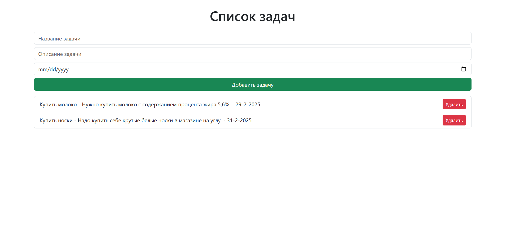

# Tracker App

Это простое тестовое приложение, созданное с использованием React и  FastAPI , предназначенное для отслеживания задач. Оно позволяет пользователям добавлять, удалять и просматривать задачи с указанием названия, описания и дедлайна. Приложение взаимодействует с сервером через  FastAPI , что позволяет выполнять операции с данными задач.

## Стек технологий

* **Frontend** : React, Bootstrap
* **Backend** : FastAPI
* **Axios** : для выполнения HTTP-запросов
* **Bootstrap** : для базовой стилизации интерфейса

## Файлы для просмотра:

back/main.py

front/testfront/src/App.js

## Пример

Вот как выглядит интерфейс приложения:

